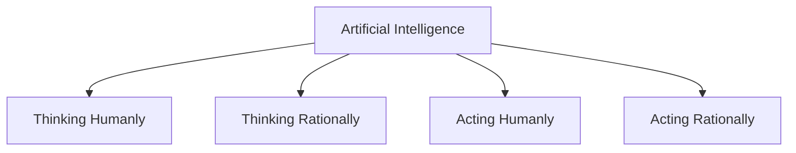
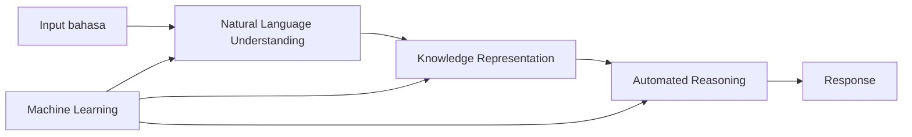
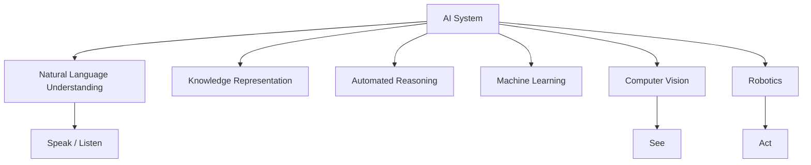
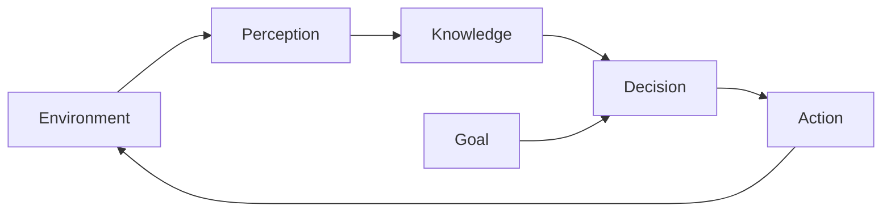
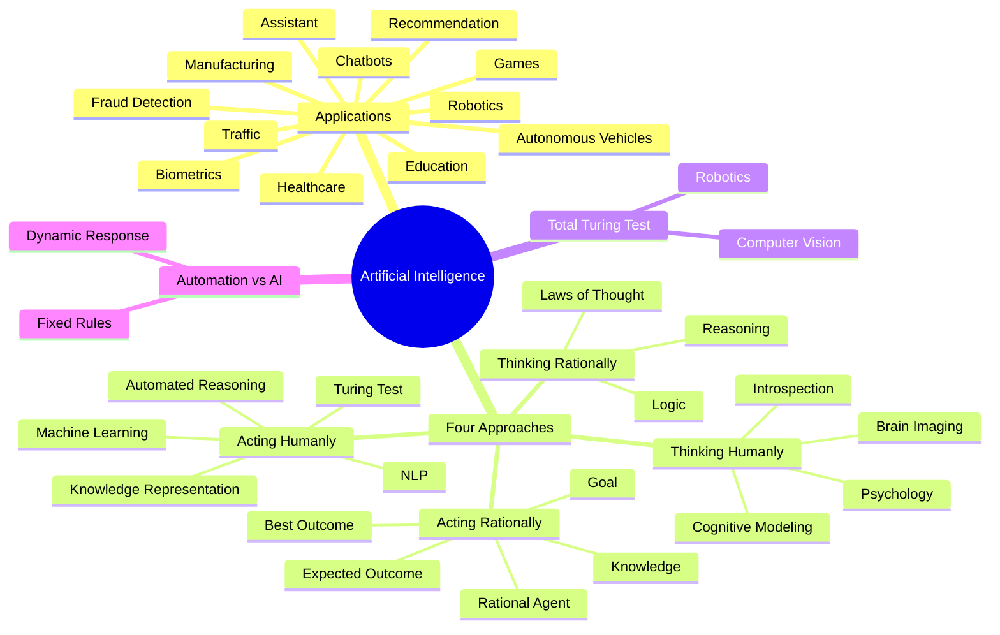

# IF3170 Inteligensi Artifisial — Materi 01a: What is AI

> [!abstract] Ringkasan
> Materi ini membahas **apa itu Artificial Intelligence (AI)**, contoh penerapan AI dalam kehidupan sehari-hari, empat pendekatan utama untuk mendefinisikan AI, **Turing Test**, **Total Turing Test**, perbedaan **automation** dan **AI**, serta latihan untuk membedakan sistem AI dan non-AI.

---

## 1. Gambaran Umum Artificial Intelligence

Artificial Intelligence atau **Inteligensi Artifisial** adalah bidang yang mempelajari bagaimana komputer atau mesin dapat melakukan aktivitas yang dianggap membutuhkan kecerdasan.

Materi tidak memberikan hanya satu definisi tunggal. Sebaliknya, AI dijelaskan dari beberapa sudut pandang.

Secara umum, pendekatan AI dalam materi dibagi menjadi empat:

| Fokus | Meniru manusia | Berorientasi rasional |
|---|---|---|
| **Cara berpikir** | Thinking humanly | Thinking rationally |
| **Cara bertindak** | Acting humanly | Acting rationally |

Keempat pendekatan tersebut adalah:

1. **Thinking humanly** — berpikir seperti manusia.
2. **Acting humanly** — bertindak seperti manusia.
3. **Thinking rationally** — berpikir secara rasional.
4. **Acting rationally** — bertindak secara rasional.

> [!important]
> Empat pendekatan ini adalah salah satu bagian paling penting dalam materi karena berbagai definisi AI yang dibahas kemudian dikelompokkan ke dalam empat kategori tersebut.

---

# 2. Contoh AI dalam Kehidupan

Sebelum masuk ke definisi formal, materi memperlihatkan banyak contoh bahwa AI sudah digunakan pada berbagai bidang.

## 2.1 AI Assistant

Contoh yang diperlihatkan adalah **personal assistant** seperti asisten suara.

Contoh perintah:

- memutar playlist,
- mengatur lampu,
- mengirim pesan,
- mengatur temperatur.

Sistem menerima input dari pengguna, memahami maksud dari perintah tersebut, kemudian melakukan aksi yang sesuai.

Secara konseptual:

```text
Perintah pengguna
      ↓
Pemahaman bahasa
      ↓
Interpretasi maksud
      ↓
Pemilihan tindakan
      ↓
Eksekusi tindakan
```

Kemampuan seperti ini berkaitan dengan:

- **Natural Language Understanding**
- pemrosesan suara,
- pengambilan keputusan,
- integrasi dengan perangkat lain.

---

## 2.2 Biometric Verification

Materi memberikan contoh:

- **fingerprint verification**
- **face verification**

Tujuan sistem adalah menentukan apakah karakteristik biometrik yang diberikan cocok dengan identitas pengguna.

Contoh alur sederhana:

```text
Data biometrik
      ↓
Ekstraksi karakteristik
      ↓
Perbandingan dengan data referensi
      ↓
Keputusan: cocok / tidak cocok
```

Contoh penggunaannya adalah verifikasi identitas pengguna atau pengemudi pada aplikasi.

---

## 2.3 AI dalam Permainan

### OpenAI Five — Dota 2

Materi menunjukkan AI yang digunakan untuk bermain **Dota 2**.

Permainan seperti Dota 2 membutuhkan kemampuan untuk:

- mengamati keadaan permainan,
- menentukan tindakan,
- mempertimbangkan konsekuensi tindakan,
- berkoordinasi,
- menyesuaikan strategi.

Karena lingkungan permainan berubah terus-menerus, sistem tidak hanya menjalankan urutan instruksi yang tetap.

---

### AlphaStar — StarCraft II

Materi juga memperlihatkan **AlphaStar** pada permainan StarCraft II.

Pada permainan strategi seperti ini, AI perlu memproses:

- keadaan permainan saat ini,
- informasi mengenai unit,
- lokasi,
- tindakan yang mungkin dilakukan,
- perubahan keadaan permainan dari waktu ke waktu.

Sistem kemudian menentukan tindakan yang dianggap paling sesuai dengan tujuan permainan.

---

## 2.4 Transform Your Face

Contoh lain adalah aplikasi yang dapat melakukan transformasi wajah, seperti:

- membuat wajah terlihat tersenyum,
- membuat wajah terlihat lebih tua,
- membuat wajah terlihat lebih muda,
- mengubah gaya penampilan.

Pada kasus ini AI bekerja pada **data citra**.

---

## 2.5 Recommender System

Materi menunjukkan contoh recommendation system pada:

- Netflix,
- YouTube,
- Spotify.

Sistem rekomendasi menggunakan informasi mengenai pengguna atau aktivitas sebelumnya untuk menentukan konten yang kemungkinan relevan.

Contoh sederhana:

```text
Riwayat pengguna
      ↓
Analisis preferensi
      ↓
Estimasi konten yang relevan
      ↓
Rekomendasi
```

Contohnya:

- film yang direkomendasikan karena sebelumnya menonton film tertentu,
- video yang direkomendasikan berdasarkan aktivitas pengguna,
- musik yang direkomendasikan berdasarkan kebiasaan mendengarkan.

---

## 2.6 AI in Traffic

Materi menunjukkan dua penggunaan AI pada sistem lalu lintas:

### Traffic Pattern

Sistem dapat memanfaatkan informasi lalu lintas untuk memperkirakan kondisi jalan.

### Path Finding / Direction

Sistem dapat mencari rute dari suatu lokasi ke lokasi lain.

Secara umum:

```text
Kondisi jalan
      ↓
Analisis kondisi lalu lintas
      ↓
Pencarian beberapa kemungkinan rute
      ↓
Pemilihan rute
```

---

## 2.7 Fraud Detection

Fraud detection digunakan untuk mendeteksi aktivitas yang dianggap mencurigakan.

Materi menunjukkan pola:

```text
Input Data
    ↓
Machine Learning / AI
    ↓
Intelligent Action
```

Contoh input dapat berupa data transaksi.

AI menganalisis pola tersebut, kemudian hasil analisis digunakan sebagai dasar tindakan untuk mengurangi risiko fraud.

---

## 2.8 Kiva — Amazon Warehouse Robot

Materi menampilkan robot gudang **Kiva**.

Robot digunakan pada lingkungan warehouse untuk membantu perpindahan barang atau rak.

Ini memperlihatkan kombinasi antara:

- persepsi terhadap lingkungan,
- navigasi,
- pengambilan keputusan,
- gerakan fisik.

---

## 2.9 AI for Health Care

AI dapat digunakan dalam bidang kesehatan.

Materi menunjukkan sejumlah area aplikasi, misalnya:

- robot-assisted surgery,
- virtual nursing assistants,
- administrative workflow,
- fraud detection,
- dosage error reduction,
- connected machines,
- clinical trial participation,
- preliminary diagnosis,
- automated image diagnosis.

Inti penggunaan AI dalam kesehatan adalah membantu mengolah informasi yang kompleks untuk mendukung aktivitas medis maupun administratif.

---

## 2.10 AI in Medical Image Analysis

Materi menunjukkan beberapa bentuk penggunaan AI pada citra medis:

- **geometry reconstruction**
- **pressure quantification**
- **3D reconstruction and mapping**
- **segmentation**
- **surface mapping**
- **flow simulation**
- **flow visualization and quantification**

### Segmentation

Segmentation berarti memisahkan bagian tertentu dari gambar sehingga struktur yang ingin dianalisis dapat diidentifikasi.

Contoh sederhana:

```text
Citra medis
     ↓
Identifikasi bagian yang relevan
     ↓
Segmentasi
     ↓
Analisis struktur
```

---

## 2.11 AI for Manufacturing

Materi menunjukkan bahwa machine learning dapat digunakan pada proses manufaktur.

Contoh area penggunaan yang ditampilkan antara lain:

- predictive maintenance,
- quality optimization,
- process visualization/automation,
- connected factory,
- integrated planning,
- data-driven resource optimization,
- digital twin,
- autonomous intelligent logistics,
- flexible production methods.

Salah satu tujuan utamanya adalah membuat proses manufaktur menjadi lebih adaptif terhadap data yang tersedia.

---

## 2.12 AI for Education

AI juga dapat digunakan dalam pendidikan.

Materi menampilkan beberapa use case seperti:

- smart content,
- interactive tutoring,
- automation and speeding up teacher tasks,
- adaptive learning environments,
- curriculum materials,
- identifying learning gaps in classroom.

Contohnya, sistem dapat menyesuaikan materi berdasarkan kebutuhan belajar pengguna.

---

## 2.13 AI Adoption by Industry

Materi menunjukkan bahwa banyak industri merencanakan adopsi AI.

Bidang yang ditampilkan antara lain:

- pharmaceutical/life science,
- automotive and aerospace,
- telecom,
- energy/oil/gas,
- manufacturing,
- fast-moving consumer goods,
- healthcare,
- financial services,
- retail,
- public sector.

Hal ini menunjukkan bahwa AI tidak terbatas pada satu domain tertentu.

---

## 2.14 Self-Driving Car

Self-driving car merupakan contoh sistem yang membutuhkan banyak kemampuan sekaligus.

Kendaraan perlu:

1. mengamati lingkungan,
2. mengenali objek,
3. memperkirakan kondisi sekitar,
4. menentukan tindakan,
5. mengendalikan kendaraan.

Contoh sistem yang disebut dalam materi adalah **Waymo**.

---

## 2.15 Self-Driving Truck

Konsep kendaraan otonom juga diterapkan pada truk.

Materi memberikan contoh:

- Otto/Uber self-driving truck,
- Daimler self-driving truck platoon.

Truk otonom membutuhkan sensor untuk mengamati lingkungan dan menentukan aksi berkendara.

---

## 2.16 Chatbots

Chatbot adalah program yang melakukan interaksi percakapan dengan pengguna.

Chatbot dapat digunakan untuk layanan seperti:

- customer service,
- informasi,
- bantuan pengguna.

Kemampuan chatbot berkaitan erat dengan pendekatan **acting humanly**, terutama ketika sistem berusaha menghasilkan respons percakapan yang menyerupai manusia.

---

## 2.17 Vacuuming Robot

Materi juga memperlihatkan:

- vacuuming robot,
- mopping robot.

Robot semacam ini dapat melakukan pekerjaan fisik secara otomatis.

Dalam sistem yang lebih cerdas, robot dapat menyesuaikan pergerakannya dengan kondisi lingkungan.

---

# 3. Apa Itu Artificial Intelligence?

Materi menggunakan **8 definisi AI** yang kemudian dikelompokkan menjadi **4 pendekatan utama**:



Pembeda utama dari keempat pendekatan tersebut adalah dua dimensi:

### Human vs Rational

- **Human** → tolok ukur kecerdasan adalah manusia.
- **Rational** → tolok ukur kecerdasan adalah tindakan atau pemikiran yang rasional.

### Thinking vs Acting

- **Thinking** → fokus pada proses internal.
- **Acting** → fokus pada perilaku atau tindakan yang dihasilkan.

---

# 4. Acting Humanly

## 4.1 Definisi

Pendekatan **acting humanly** melihat AI berdasarkan kemampuan mesin untuk **berperilaku seperti manusia**.

Definisi yang diberikan dalam materi antara lain:

> AI adalah seni membuat mesin yang melakukan fungsi yang membutuhkan kecerdasan apabila dilakukan oleh manusia.

Definisi lainnya:

> AI mempelajari bagaimana membuat komputer melakukan hal-hal yang pada saat itu masih lebih baik dilakukan oleh manusia.

Fokus utamanya bukan bagaimana mesin berpikir secara internal, melainkan **apakah perilaku mesin terlihat seperti perilaku manusia**.

---

# 5. Turing Test

## 5.1 Ide Dasar

Turing Test digunakan sebagai pendekatan operasional untuk menilai kecerdasan.

Skema dasarnya:

```text
Human Interrogator
       │
       ├── Human
       │
       └── AI System
```

Interrogator berkomunikasi tanpa mengetahui mana manusia dan mana komputer.

AI dianggap berhasil apabila:

> interrogator manusia tidak dapat menentukan apakah respons berasal dari manusia atau komputer.

Dengan demikian, yang diamati adalah **hasil perilaku eksternal sistem**.

---

# 6. Kemampuan Manusia yang Berhubungan dengan AI

Materi menghubungkan beberapa kemampuan manusia dengan organ dan kemampuan komputasional.

| Kemampuan manusia | Organ | Padanan kemampuan pada sistem |
|---|---|---|
| Speak | Mouth | komunikasi bahasa |
| Listen | Ear | menerima informasi suara |
| Think | Brain | knowledge, reasoning, learning |
| See | Eye | vision processing |
| Smell | Nose | smell processing |
| Feel / manipulate | Finger | manipulasi objek dan gerakan |

Konsep ini digunakan untuk menjelaskan kemampuan apa saja yang perlu dimiliki AI apabila ingin meniru manusia.

---

# 7. AI Capabilities for Turing Test

Untuk menjalani Turing Test dalam bentuk percakapan, materi menunjukkan beberapa kemampuan utama.

## 7.1 Natural Language Understanding

Sistem harus dapat memahami bahasa yang digunakan manusia.

## 7.2 Knowledge Representation

AI perlu memiliki cara untuk menyimpan informasi atau pengetahuan yang relevan.

## 7.3 Automated Reasoning

AI perlu menggunakan pengetahuan untuk menghasilkan kesimpulan atau menentukan respons.

## 7.4 Machine Learning

AI perlu memiliki kemampuan belajar atau menyesuaikan diri berdasarkan data atau pengalaman.

Secara sederhana:



---

# 8. Loebner Prize

Materi membahas **Loebner Prize**, yaitu kompetisi dalam Artificial Intelligence yang bertujuan mencari program chatbot percakapan terbaik.

Beberapa contoh yang disebutkan:

- PC Therapist III,
- PC Professor,
- PC Politician,
- Rose,
- Mitsuku.

Mitsuku beberapa kali menjadi pemenang pada tahun-tahun yang ditampilkan dalam materi.

Materi juga menyebut bahwa kompetisi tersebut kemudian berakhir dan menjadi tidak aktif sekitar tahun 2020.

Loebner Prize merupakan salah satu implementasi kompetisi yang terinspirasi oleh ide **Turing Test**.

---

# 9. Total Turing Test

Turing Test biasa terutama berfokus pada percakapan.

**Total Turing Test** memperluas kemampuan yang diuji.

AI tidak hanya perlu:

- berbicara,
- mendengar,
- berpikir,

tetapi juga:

- **melihat**,
- **bertindak secara fisik**.

Kemampuan tambahan yang dibutuhkan:

### Computer Vision

Digunakan agar AI dapat memproses informasi visual dari kamera.

### Robotics

Digunakan agar AI dapat melakukan tindakan terhadap lingkungan melalui actuator.

Diagram konseptual:



---

# 10. Catatan terhadap Pendekatan Acting Humanly

Materi menekankan bahwa:

> mempelajari prinsip dasar kecerdasan dianggap lebih penting daripada sekadar menduplikasi perilaku manusia.

Karena itu, meskipun Turing Test merupakan konsep penting dalam sejarah AI, pengembangan AI tidak selalu diarahkan hanya untuk "lulus Turing Test".

---

# 11. Thinking Humanly

## 11.1 Definisi

Pendekatan **thinking humanly** berfokus pada bagaimana membuat mesin **berpikir seperti manusia**.

Beberapa definisi dalam materi menekankan:

- membuat komputer berpikir,
- membuat mesin memiliki pikiran,
- mengotomatisasi aktivitas yang berkaitan dengan pemikiran manusia seperti:
  - decision making,
  - problem solving,
  - learning.

Berbeda dengan acting humanly, yang diperhatikan adalah **proses internal**.

---

## 11.2 Bagaimana Mengetahui Cara Manusia Berpikir?

Materi menunjukkan tiga cara untuk mempelajari proses berpikir manusia.

### 1. Introspection

Mengamati pikiran kita sendiri ketika proses berpikir berlangsung.

### 2. Psychological Experiment

Mengamati manusia saat melakukan tindakan atau memecahkan masalah.

### 3. Brain Imaging

Mengamati aktivitas otak saat manusia melakukan suatu proses.

---

# 12. Cognitive Modeling Approach

Pendekatan **cognitive modeling** berusaha membangun model komputasional dari proses mental manusia.

Bidang yang digabungkan antara lain:

- model komputer dari AI,
- teknik eksperimen dari psikologi.

Tujuannya adalah membangun teori mengenai proses mental manusia yang:

- spesifik,
- dapat diuji,
- dapat dibandingkan dengan perilaku manusia.

Konsep sederhananya:

```text
Observasi manusia
      ↓
Hipotesis proses berpikir
      ↓
Model komputasional
      ↓
Eksperimen
      ↓
Perbandingan model dengan manusia
```

Dengan demikian, sistem bukan hanya menghasilkan jawaban yang sama seperti manusia, tetapi juga mencoba bekerja dengan proses internal yang menyerupai manusia.

---

# 13. Thinking Rationally

## 13.1 Definisi

Pendekatan **thinking rationally** melihat AI sebagai sistem yang berpikir menggunakan prinsip penalaran yang benar.

Materi memberikan definisi yang berkaitan dengan:

- penggunaan model komputasional untuk mempelajari kemampuan mental,
- komputasi yang memungkinkan sistem untuk:
  - perceive,
  - reason,
  - act.

---

## 13.2 Laws of Thought Approach

Thinking rationally berkaitan dengan **laws of thought**.

Ide utamanya:

> jika proses penalaran dilakukan dengan aturan yang benar, maka sistem dapat menghasilkan kesimpulan yang benar.

Fokus utama:

- reasoning,
- logika,
- aturan inferensi.

Contoh umum bentuk penalaran logis:

```text
Premis
  ↓
Aturan inferensi
  ↓
Kesimpulan
```

Dalam latihan materi, contoh penggunaan **modus ponens**, **modus tollens**, dan aturan inferensi lainnya termasuk pendekatan thinking rationally.

---

# 14. Acting Rationally

## 14.1 Definisi

Pendekatan **acting rationally** melihat AI sebagai sistem yang melakukan tindakan secara rasional.

Materi menghubungkan pendekatan ini dengan konsep **intelligent agent**.

Sistem memiliki:

- **goal**,
- **knowledge**,

kemudian menentukan tindakan untuk mencapai hasil yang terbaik.

---

## 14.2 Rational Agent

Materi mendefinisikan rational agent sebagai agen yang bertindak untuk:

> mencapai hasil terbaik, atau jika terdapat ketidakpastian, mencapai hasil dengan expected outcome terbaik.

Secara sederhana:



---

## 14.3 Rationality Tidak Sama dengan Correct Inference

Materi menekankan bahwa **correct inference saja tidak selalu cukup untuk menghasilkan tindakan rasional**.

Mengapa?

Karena pada beberapa situasi:

- tidak ada pilihan yang dapat dibuktikan sepenuhnya benar,
- informasi mungkin tidak lengkap,
- keadaan mengandung ketidakpastian,
- tetapi sistem tetap harus melakukan sesuatu.

Jadi acting rationally tidak hanya membutuhkan logika, tetapi juga pemilihan tindakan yang paling baik berdasarkan kondisi yang tersedia.

---

# 15. Perbandingan Empat Pendekatan AI

| Pendekatan | Fokus | Tolok ukur | Pertanyaan utama |
|---|---|---|---|
| **Thinking Humanly** | proses berpikir | manusia | Apakah sistem berpikir seperti manusia? |
| **Acting Humanly** | perilaku | manusia | Apakah sistem bertindak seperti manusia? |
| **Thinking Rationally** | penalaran | prinsip rasional | Apakah sistem berpikir dengan benar? |
| **Acting Rationally** | tindakan | tujuan terbaik | Apakah sistem memilih tindakan terbaik? |

Cara cepat membedakannya:

```text
Humanly  → bandingkan dengan manusia
Rationally → bandingkan dengan tindakan/pemikiran rasional

Thinking → fokus proses internal
Acting   → fokus perilaku atau aksi
```

> [!tip] Cara mengingat
> **Humanly = mirip manusia**, sedangkan **Rationally = masuk akal untuk mencapai tujuan**.
>
> **Thinking = bagaimana proses berpikirnya**, sedangkan **Acting = apa tindakan yang dilakukan**.

---

# 16. AI Revolution

Materi menyampaikan bahwa AI modern tidak selalu mencoba merekonstruksi otak manusia secara langsung.

Alasannya:

- pemahaman manusia mengenai cara kerja otak masih terbatas,
- karena itu membangun ulang otak secara penuh juga belum realistis.

AI modern lebih banyak memanfaatkan kombinasi:

- **machine learning**,
- **massive data sets**,
- **sophisticated sensors**,
- **algorithms**.

Tujuannya adalah menguasai berbagai **discrete tasks**.

Artinya, AI dapat sangat baik dalam suatu tugas tertentu tanpa harus bekerja persis seperti otak manusia.

---

# 17. AI vs Non-AI Applications

Materi membahas bahwa batas antara aplikasi AI dan non-AI dapat berubah.

Salah satu pernyataan penting yang ditampilkan adalah:

> “By definition, no AI ever works; if it works, it’s not AI.”

Pernyataan ini bersifat paradoks dan menggambarkan fenomena bahwa ketika suatu teknologi AI sudah menjadi umum dan mapan, orang sering berhenti menyebutnya sebagai AI.

Contoh area yang disebut:

- information retrieval,
- data mining,
- game technology.

Artinya, teknologi yang dahulu dianggap sebagai bagian dari AI dapat berkembang menjadi bidang yang berdiri sendiri.

---

# 18. Automation vs AI

Salah satu bagian penting materi adalah membedakan **automation** dengan **AI**.

## 18.1 Automation

Automation membuat sistem dapat menyelesaikan pekerjaan dengan **cara yang sama setiap kali**.

Cocok untuk tugas yang:

- aturan kerjanya tetap,
- tidak membutuhkan banyak perubahan,
- tidak memerlukan interpretasi kompleks.

Potensi manfaat:

- meningkatkan produktivitas,
- mengurangi biaya operasional,
- menyederhanakan workflow.

Contoh konseptual:

```text
Input
  ↓
Aturan tetap
  ↓
Output
```

---

## 18.2 Artificial Intelligence

AI dirancang agar sistem mampu merespons perubahan informasi atau kebutuhan dari lingkungan secara **dinamis**.

AI cocok untuk tugas yang:

- lebih kompleks,
- membutuhkan interpretasi,
- membutuhkan keputusan,
- dapat berubah berdasarkan kondisi.

Potensi manfaat:

- meningkatkan produktivitas,
- menurunkan biaya operasional,
- membangun workflow yang lebih cerdas,
- menyesuaikan diri terhadap kebutuhan yang berubah.

Contoh konseptual:

```text
Input + kondisi lingkungan
        ↓
     Analisis
        ↓
Interpretasi / keputusan
        ↓
      Output
```

---

## 18.3 Perbandingan Automation dan AI

| Automation | Artificial Intelligence |
|---|---|
| Menjalankan tugas dengan cara yang sama | Dapat merespons perubahan informasi |
| Cocok untuk aturan yang tetap | Cocok untuk masalah yang lebih kompleks |
| Tidak selalu membutuhkan interpretasi | Dapat membutuhkan interpretive decision |
| Workflow relatif statis | Workflow dapat berubah secara dinamis |

> [!example]
> Sistem yang selalu menjalankan rumus yang sama pada format data yang sudah tetap lebih dekat ke **automation**.
>
> Sistem yang mengamati kondisi lingkungan kemudian menyesuaikan tindakan berdasarkan kondisi tersebut lebih dekat ke **AI**.

---

# 19. Latihan Pendekatan AI

## Soal 1

> Pengenalan gambar menggunakan hierarchical temporal memory yang meniru prinsip biologi neocortex merupakan contoh pendekatan apa?

**Jawaban: Thinking Humanly**

### Alasan

Sistem mencoba meniru mekanisme yang berkaitan dengan cara kerja biologis manusia, sehingga fokusnya adalah **bagaimana proses internal manusia bekerja**.

---

## Soal 2

> Dengan pengetahuan dan tujuan yang ingin dicapai, sistem mencari rangkaian aksi untuk menghasilkan solusi terbaik.

**Jawaban: Acting Rationally**

### Alasan

Kata kuncinya adalah:

- goal,
- knowledge,
- mencari aksi,
- solusi terbaik.

Hal tersebut sesuai dengan konsep **rational agent**.

---

## Soal 3

> Sistem pakar mengimitasi perilaku pakar dalam mendiagnosis penyakit tanaman berdasarkan pengamatan terhadap perilaku pakar.

**Jawaban: Acting Humanly**

### Alasan

Tujuan sistem adalah meniru **perilaku** seorang pakar manusia.

Karena yang ditiru adalah tindakan atau perilaku eksternal, pendekatannya adalah acting humanly.

---

## Soal 4

> Logic puzzle diselesaikan melalui pencarian menggunakan backtracking.

**Jawaban: Acting Rationally**

### Alasan

Sistem mencari rangkaian tindakan atau pilihan yang menghasilkan solusi terhadap suatu tujuan.

Ini sesuai dengan pendekatan agen rasional yang memilih tindakan untuk mencapai goal.

---

## Soal 5

> Teka-teki diselesaikan dengan kaidah inferensi logika seperti modus ponens dan modus tollens.

**Jawaban: Thinking Rationally**

### Alasan

Fokusnya adalah penggunaan aturan penalaran logis atau **laws of thought** untuk menghasilkan kesimpulan.

---

# 20. Latihan AI vs Non-AI

## Kasus 1 — Software Akuntansi

Software menghitung rugi laba menggunakan rumus yang sudah ditentukan, dengan format input yang tetap.

**Klasifikasi: Non-AI / Automation**

Alasannya:

- struktur input sudah pasti,
- rumus sudah ditentukan,
- tidak diperlukan interpretasi dinamis.

---

## Kasus 2 — Lampu Lalu Lintas Berdasarkan Jumlah Kendaraan

Waktu lampu merah, kuning, dan hijau ditentukan berdasarkan jumlah kendaraan dari citra CCTV.

**Klasifikasi: AI**

Alasannya:

- sistem memperoleh kondisi lingkungan,
- data dari gambar perlu diproses,
- keputusan waktu lampu dapat berubah berdasarkan kondisi tersebut.

---

## Kasus 3 — Sistem Tanya Jawab Hotel Berbasis Flowchart

Sistem menggunakan flowchart yang sudah ditentukan dan pengguna hanya memilih kandidat input yang disediakan.

**Klasifikasi: Non-AI / Automation**

Alasannya:

- alur sudah ditentukan sebelumnya,
- pilihan pengguna terbatas,
- sistem tidak melakukan interpretasi bebas terhadap kondisi baru.

---

## Kasus 4 — Lampu dengan Sensor Gerak

Lampu menyala jika ada objek bergerak dan mati setelah tidak ada gerakan selama waktu tertentu.

**Klasifikasi: Non-AI / Automation**

Alasannya:

- perilaku sistem mengikuti aturan kondisi sederhana,
- tidak terdapat proses interpretasi atau pengambilan keputusan kompleks,
- output ditentukan oleh aturan tetap.

---

# 21. Rangkuman Inti Materi

> [!summary] Hal yang perlu diingat
> 1. AI memiliki banyak bentuk penerapan dalam kehidupan sehari-hari.
> 2. Definisi AI dapat dikelompokkan menjadi empat pendekatan:
>    - Thinking Humanly
>    - Acting Humanly
>    - Thinking Rationally
>    - Acting Rationally
> 3. **Turing Test** menguji apakah perilaku percakapan AI dapat dibedakan dari manusia.
> 4. **Total Turing Test** menambahkan kemampuan melihat dan bertindak.
> 5. Thinking Humanly berkaitan dengan model proses kognitif manusia.
> 6. Thinking Rationally berkaitan dengan reasoning dan laws of thought.
> 7. Acting Rationally berkaitan dengan rational agent yang memilih tindakan terbaik berdasarkan goal dan knowledge.
> 8. AI modern tidak harus meniru otak manusia secara langsung.
> 9. Automation menjalankan aturan yang relatif tetap, sedangkan AI dapat merespons perubahan kondisi secara dinamis.

---

# 22. Peta Konsep



---

# 23. Cheat Sheet

## Empat Pendekatan

```text
Thinking Humanly   = berpikir seperti manusia
Acting Humanly     = bertindak seperti manusia
Thinking Rationally = berpikir menggunakan reasoning yang benar
Acting Rationally   = bertindak untuk mencapai hasil terbaik
```

## Turing Test

```text
Tujuan:
AI memberikan respons yang tidak dapat dibedakan dari manusia.

Kemampuan utama:
- Natural Language Understanding
- Knowledge Representation
- Automated Reasoning
- Machine Learning
```

## Total Turing Test

```text
Turing Test
+ Computer Vision
+ Robotics
```

## Rational Agent

```text
Perception
   ↓
Knowledge + Goal
   ↓
Decision
   ↓
Best Action
```

## Automation vs AI

```text
Automation:
aturan relatif tetap → hasil

AI:
kondisi lingkungan → interpretasi → keputusan → tindakan
```

---

# 24. Pertanyaan Review Mandiri

1. Apa perbedaan **Thinking Humanly** dan **Acting Humanly**?
2. Apa perbedaan **Thinking Rationally** dan **Acting Rationally**?
3. Mengapa Turing Test termasuk pendekatan acting humanly?
4. Apa saja kemampuan AI yang diperlukan untuk Turing Test?
5. Apa kemampuan tambahan dalam Total Turing Test?
6. Apa yang dimaksud dengan cognitive modeling?
7. Bagaimana introspection, psychological experiment, dan brain imaging digunakan dalam pendekatan thinking humanly?
8. Apa yang dimaksud laws of thought?
9. Mengapa correct inference belum tentu cukup untuk menghasilkan tindakan rasional?
10. Apa yang dimaksud rational agent?
11. Apa perbedaan automation dengan AI?
12. Mengapa software dengan aturan tetap belum tentu dapat disebut AI?
13. Mengapa sistem rekomendasi termasuk contoh AI?
14. Bagaimana self-driving car menunjukkan gabungan beberapa kemampuan AI?
15. Mengapa batas antara AI dan non-AI dapat berubah seiring perkembangan teknologi?

---

# 25. Kesimpulan

Materi **What is AI** menunjukkan bahwa Artificial Intelligence tidak dapat dijelaskan hanya sebagai “komputer yang pintar”.

AI dapat dilihat dari berbagai sudut pandang:

- apakah mesin **berpikir seperti manusia**,
- apakah mesin **bertindak seperti manusia**,
- apakah mesin **berpikir secara rasional**,
- atau apakah mesin **bertindak secara rasional**.

Dalam praktiknya, banyak sistem AI modern lebih berorientasi pada kemampuan menyelesaikan tugas tertentu dengan memanfaatkan data, machine learning, sensor, dan algoritma.

Perbedaan penting lainnya adalah antara **automation** dan **AI**. Automation terutama menjalankan aturan yang sudah ditentukan, sedangkan AI diarahkan untuk dapat merespons informasi atau perubahan lingkungan dan membuat keputusan yang lebih dinamis.
