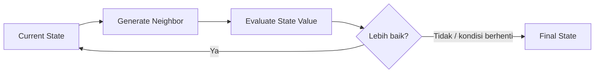
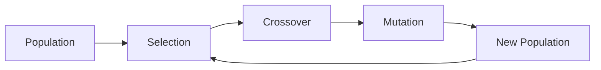
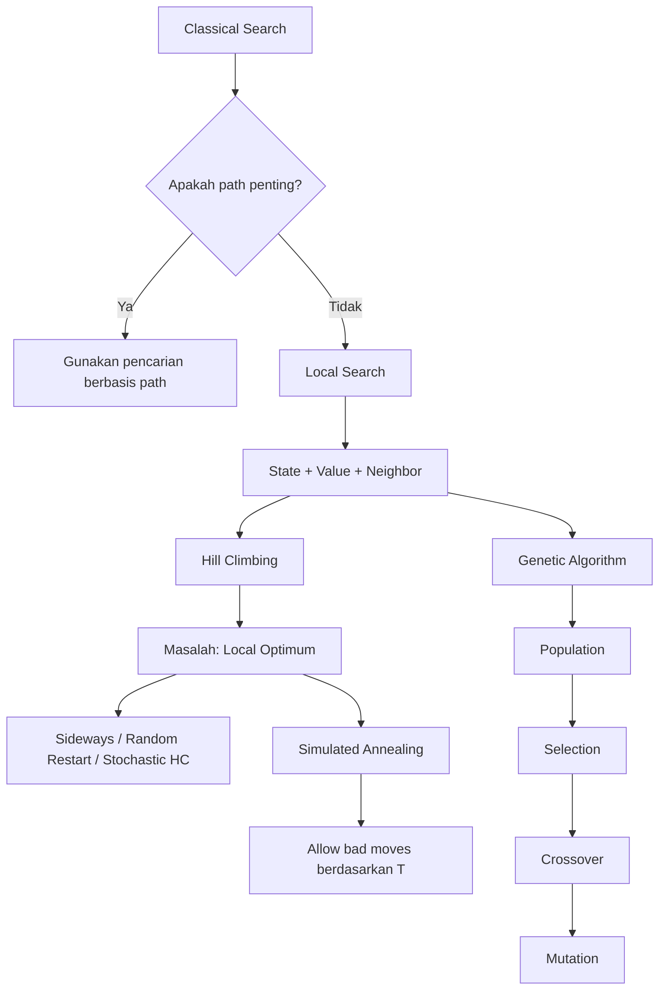

# IF3170 — Beyond Classical Search

> [!abstract] Inti materi
> Pada **classical search**, solusi biasanya berupa **jalur/rangkaian aksi menuju goal**. Namun, ada banyak masalah optimasi di mana kita tidak terlalu peduli bagaimana solusi itu ditemukan; yang penting adalah **konfigurasi akhirnya sebaik mungkin**.
>
> Dari kebutuhan inilah muncul **local search**, lalu berkembang menjadi beberapa algoritma seperti **Hill Climbing, Simulated Annealing, dan Genetic Algorithm**.

---

## 1. Mengapa Tidak Selalu Menggunakan Classical Search?

Pada classical search seperti BFS, DFS, UCS, atau A*, kita biasanya membangun ruang pencarian secara sistematis.

Misalnya pada N-Puzzle:

```text
initial state
    ↓
aksi 1
    ↓
state baru
    ↓
aksi 2
    ↓
...
    ↓
goal
```

Solusinya bukan hanya *goal state*, tetapi juga **urutan aksi untuk mencapai goal tersebut**.

Hal ini masuk akal pada masalah seperti pencarian rute atau puzzle, karena kita memang perlu tahu:

> "Bagaimana cara dari keadaan awal sampai ke keadaan tujuan?"

Namun, tidak semua masalah membutuhkan jalur tersebut.

### Contoh: N-Queens

Pada N-Queens, tujuan kita hanyalah mendapatkan konfigurasi akhir di mana tidak ada dua queen yang saling menyerang.

Misalnya:

```text
X = (8, 6, 4, 2, 7, 5, 3, 1)
```

Artinya queen pada setiap kolom diletakkan pada baris tertentu.

Yang penting adalah:

> apakah konfigurasi akhirnya valid?

Kita tidak terlalu peduli queen mana yang dipindahkan lebih dahulu.

Karena itu, dibanding menyimpan seluruh jalur pencarian, kita dapat fokus hanya pada **satu konfigurasi saat ini**, lalu terus memperbaikinya.

Inilah ide dasar **Local Search**.

---

# 2. Local Search

Local search bekerja dengan cara yang berbeda dari classical search.

Alih-alih menyimpan banyak path, algoritma hanya mempertahankan:

```text
current state
```

Kemudian dari state tersebut, algoritma mencari **neighbor** yang lebih baik.



Dalam local search:

- state biasanya berupa **complete configuration**,
- path menuju state tidak penting,
- aksi berarti berpindah ke **neighbor**,
- kualitas state dinilai menggunakan **objective function / heuristic value**,
- solusi adalah **final state** terbaik yang ditemukan.

---

## Classical Search vs Local Search

Contoh paling mudah terlihat pada N-Queens.

| Classical Search | Local Search |
|---|---|
| State dapat berupa konfigurasi yang belum lengkap | State langsung berupa konfigurasi lengkap |
| Misalnya mulai dari papan kosong | Bisa mulai dari konfigurasi random |
| Action: menambahkan queen | Action: memindahkan satu queen |
| Menyimpan path | Hanya menyimpan current state |
| Solusi = path menuju goal | Solusi = final configuration |

Jadi pola pikir local search bukan:

> "Bagaimana mencapai goal?"

tetapi:

> "Dari konfigurasi sekarang, ke mana saya harus bergerak supaya konfigurasi menjadi lebih baik?"

---

# 3. State, Value, Successor, dan Neighbor

Empat konsep ini menjadi dasar untuk memahami algoritma local search.

## State

State adalah **satu konfigurasi lengkap** dari masalah.

Untuk 8-Queens:

```text
Q1 Q2 Q3 Q4 Q5 Q6 Q7 Q8
```

Setiap queen sudah memiliki posisi masing-masing.

---

## State Value

Karena local search mencari state yang "lebih baik", kita membutuhkan suatu nilai untuk mengukur kualitas state.

Pada contoh 8-Queens di materi digunakan:

\[h = -(\text{jumlah pasangan queen yang saling menyerang})\]

Contoh:

```text
1 pasangan queen menyerang
→ h = -1
```

Goal terbaik adalah:

\[
h = 0
\]

karena tidak ada queen yang saling menyerang.

> [!important]
> Pada contoh ini **semakin besar nilai h semakin baik**.
>
> Maka:
>
> `h = -1` lebih baik daripada `h = -5`.

---

## Successor

Successor adalah state yang dapat diperoleh setelah melakukan satu perubahan terhadap current state.

Untuk 8-Queens, satu aksi didefinisikan sebagai:

> memindahkan **satu queen** ke baris lain pada **kolom yang sama**.

Karena terdapat:

- 8 queen,
- masing-masing memiliki 7 posisi lain,

maka satu state mempunyai:

\[
8 \times 7 = 56
\]

kemungkinan successor.

---

## Neighbor

Neighbor adalah successor yang dipertimbangkan untuk menjadi state berikutnya.

Cara memilihnya dapat berbeda tergantung algoritma.

Contohnya:

### Highest-valued successor

Evaluasi semua successor lalu pilih yang memiliki nilai terbaik.

```text
current
   ↓
56 successors
   ↓
hitung nilai masing-masing
   ↓
ambil yang terbaik
```

### Random successor

Tidak mengevaluasi semua successor. Kita cukup mengambil salah satu successor secara random.

Konsep pemilihan neighbor inilah yang kemudian membedakan beberapa algoritma local search.

---

# 4. State-Space Landscape

Local search dapat dibayangkan seperti seseorang yang berjalan pada sebuah **landscape**.

- posisi horizontal = **state**
- ketinggian = **state value**

Tujuan kita adalah mencapai:

> **global maximum**

yaitu state dengan nilai terbaik secara keseluruhan.

Masalahnya, dari posisi tertentu kita mungkin bertemu sesuatu yang terlihat seperti puncak, padahal sebenarnya masih ada puncak yang lebih tinggi.

Beberapa kondisi penting:

### Global Maximum

State terbaik di seluruh ruang pencarian.

### Local Maximum

State yang lebih baik daripada semua neighbor di sekitarnya, tetapi bukan state terbaik secara global.

### Flat Local Maximum

Area datar di mana neighbor mempunyai nilai yang sama sehingga algoritma tidak mengetahui arah yang lebih baik.

### Shoulder

Area datar sementara, tetapi masih terdapat jalan menuju nilai yang lebih tinggi.

Masalah local optimum ini menjadi alasan utama mengapa algoritma local search tidak cukup hanya menggunakan strategi "selalu ambil yang terbaik".

---

# 5. Hill-Climbing Search

Hill Climbing mempunyai ide yang sangat sederhana:

> terus berpindah ke neighbor yang lebih baik sampai tidak ada neighbor yang lebih baik lagi.

Materi menggambarkannya sebagai:

> *"Like climbing Everest in thick fog with amnesia."*

Analogi ini cocok karena algoritma:

- hanya melihat keadaan di sekitar,
- tidak mengetahui keseluruhan landscape,
- tidak mengingat path yang sudah dilewati.

Alur dasarnya:

```text
buat initial state secara random
          ↓
cari neighbor terbaik
          ↓
apakah neighbor lebih baik?
       /            \
     ya              tidak
     ↓                ↓
 pindah          berhenti
```

Dalam **Steepest-Ascent Hill Climbing**, kita mengevaluasi successor lalu memilih successor dengan nilai tertinggi.

Pseudo-logika sederhananya:

```python
current = initial_state

while True:
    neighbor = highest_valued_successor(current)

    if value(neighbor) <= value(current):
        return current

    current = neighbor
```

---

## Mengapa Hill Climbing Bisa Gagal?

Hill climbing hanya mau bergerak ke arah yang lebih baik.

Misalkan perjalanan nilai:

```text
h = -17
   ↓
h = -12
   ↓
h = -7
   ↓
h = -4
   ↓
h = -3
   ↓
h = -1
```

Pada `h = -1`, mungkin tidak ada neighbor dengan nilai lebih tinggi.

Algoritma kemudian berhenti.

Padahal goal sebenarnya adalah:

```text
h = 0
```

Berarti algoritma terjebak pada **local optimum**.

Pada contoh 8-Queens dalam materi, hill climbing dasar:

- bekerja cepat saat berhasil,
- tetapi dapat stuck sangat sering,
- hanya menyelesaikan sekitar **14%** instance yang dicoba.

Jadi kelemahan utamanya bukan kecepatannya, melainkan:

> keputusan yang terlalu greedy berdasarkan keadaan lokal.

---

# 6. Variasi Hill Climbing

Untuk mengurangi masalah local optimum, ada beberapa variasi.

## Hill Climbing + Sideways Move

Biasanya hill climbing hanya menerima:

```text
neighbor.value > current.value
```

Pada sideways move, algoritma juga boleh menerima:

```text
neighbor.value == current.value
```

Tujuannya adalah melewati daerah **flat/shoulder**.

Tetapi perpindahan sideways perlu diberi batas supaya algoritma tidak bergerak selamanya pada area datar.

Dalam contoh materi, batas 100 sideways moves meningkatkan tingkat keberhasilan 8-Queens dari:

```text
14% → 94%
```

Namun konsekuensinya adalah jumlah langkah menjadi jauh lebih banyak.

Jadi terdapat trade-off:

```text
lebih mudah keluar dari flat area
            ↕
     pencarian lebih lambat
```

---

## Random-Restart Hill Climbing

Ide berikutnya sangat sederhana:

> jika percobaan pertama gagal, mulai lagi dari initial state random yang baru.

```text
Random State A → Hill Climbing → stuck
Random State B → Hill Climbing → stuck
Random State C → Hill Climbing → goal
```

Karena local optimum sangat dipengaruhi oleh initial state, restart memberi kesempatan untuk memulai dari bagian landscape yang berbeda.

Jika probabilitas berhasil satu kali hill climbing adalah \(p\), maka perkiraan jumlah restart:

\[
\frac{1}{p}
\]

Pada contoh `p = 0.14`:

\[
\frac{1}{0.14} \approx 7
\]

restart.

---

## Stochastic Hill Climbing

Pada steepest ascent, kita mencari neighbor terbaik dari seluruh successor.

Stochastic hill climbing tidak melakukan itu.

Algoritma:

1. memilih successor secara random,
2. membandingkannya dengan current state,
3. pindah jika successor tersebut lebih baik.

Artinya biaya untuk mengevaluasi neighbor dapat lebih kecil, tetapi algoritma biasanya membutuhkan lebih banyak iterasi.

---

# 7. Dari Hill Climbing ke Simulated Annealing

Masalah fundamental Hill Climbing adalah:

> ia **tidak pernah mau menjadi lebih buruk**, walaupun terkadang kita harus turun dahulu agar dapat mencapai puncak yang lebih tinggi.

Bayangkan posisi kita seperti ini:

```text
        GLOBAL MAX
            /\
           /  \
          /    \
   local /\     \
        /  \____/
       ↑
    current
```

Untuk keluar dari local maximum, kita mungkin harus bergerak **turun terlebih dahulu**.

Hill climbing tidak mau melakukan hal tersebut.

Simulated Annealing mengizinkannya.

---

# 8. Simulated Annealing

Simulated Annealing menggabungkan dua ide:

- **Hill Climbing** → efisien tetapi mudah terjebak local optimum.
- **Random Walk** → lebih bebas menjelajahi ruang pencarian tetapi sangat tidak efisien.

Prinsipnya:

> pada awal pencarian, algoritma cukup bebas melakukan langkah buruk; semakin lama, perilakunya menjadi semakin mirip hill climbing.

Hal ini diatur menggunakan variabel:

\[
T = \text{temperature}
\]

yang akan semakin kecil seiring waktu.

---

## Memilih Neighbor

Simulated Annealing memilih satu successor secara random.

Kemudian:

\[
\Delta E = value(next) - value(current)
\]

### Jika neighbor lebih baik

\[
\Delta E > 0
\]

langsung pindah ke neighbor tersebut.

### Jika neighbor lebih buruk

\[
\Delta E < 0
\]

neighbor **masih mungkin diterima**, dengan probabilitas:

\[
P = e^{\Delta E/T}
\]

---

## Peran Temperature

Inilah bagian paling penting dari simulated annealing.

### Saat T tinggi

Probabilitas menerima state buruk masih besar.

Contoh dari materi:

\[
\Delta E=-5,\quad T=100
\]

menghasilkan probabilitas sekitar:

\[
P \approx 0.95
\]

Artinya algoritma masih sangat eksploratif dan menyerupai **random walk**.

### Saat T rendah

Misalnya:

\[
\Delta E=-5,\quad T=1
\]

probabilitas menjadi sekitar:

\[
P \approx 0.007
\]

Algoritma hampir tidak mau menerima state buruk lagi dan perilakunya mendekati **stochastic hill climbing**.

Jadi secara intuitif:

```text
T tinggi
→ eksplorasi tinggi
→ berani melakukan bad move

T turun
→ bad move semakin jarang

T mendekati 0
→ hampir selalu memilih perbaikan
```

---

## Contoh

Misalnya:

```text
current h = -1
next h    = -2
T         = 10
```

Maka:

\[
\Delta E=-2-(-1)=-1
\]

\[
P=e^{-1/10}=e^{-0.1}\approx0.9
\]

Walaupun `h=-2` lebih buruk daripada `h=-1`, algoritma masih memiliki kemungkinan sekitar `0.9` untuk menerima perpindahan tersebut.

Mengapa melakukan sesuatu yang sengaja lebih buruk?

Karena state buruk tersebut bisa menjadi jalan keluar dari local optimum menuju state yang jauh lebih baik.

---

> [!important] Intuisi Simulated Annealing
> Hill Climbing bertanya:
>
> **"Apakah state berikutnya lebih baik?"**
>
> Simulated Annealing bertanya:
>
> **"Kalau lebih buruk, apakah masih layak dicoba untuk sementara?"**

Jika temperature diturunkan cukup perlahan, materi menyatakan bahwa probabilitas menemukan global optimum dapat mendekati 1.

---

# 9. Genetic Algorithm

Hill Climbing dan Simulated Annealing mempertahankan **satu current state**.

Genetic Algorithm mengambil pendekatan yang berbeda:

> kita mempertahankan **sekumpulan state sekaligus**, yang disebut **population**.

Satu state disebut **individual**.

---

## Representasi Individual

State biasanya direpresentasikan sebagai string.

Pada N-Queens:

```text
32752411
```

Setiap karakter merepresentasikan satu variabel, yaitu posisi queen pada kolom tertentu.

Dengan cara ini, state dapat dengan mudah:

- dibandingkan,
- dipilih,
- digabungkan,
- dimutasi.

---

## Fitness Function

Setiap individual mempunyai nilai **fitness**.

Semakin tinggi fitness:

> semakin baik individual tersebut.

Pada N-Queens, fitness didefinisikan sebagai jumlah pasangan queen yang **tidak saling menyerang**.

Untuk 8 queen, jumlah seluruh pasangan adalah:

\[
\frac{8(7)}{2}=28
\]

Maka nilai maksimum:

\[
Fitness = 28
\]

Jika suatu konfigurasi memiliki 5 pasangan yang menyerang:

\[
Fitness = 28-5=23
\]

---

# 10. Siklus Genetic Algorithm

GA dimulai dengan beberapa state random.

Misalnya:

```text
Individual A → F = 24
Individual B → F = 23
Individual C → F = 20
Individual D → F = 11
```

Kemudian generasi berikutnya dibentuk melalui tiga proses utama:



---

## 1. Selection

Individual dengan fitness lebih tinggi mempunyai kemungkinan lebih besar untuk menjadi parent.

Contoh:

```text
F = 24 → 31%
F = 23 → 29%
F = 20 → 26%
F = 11 → 14%
```

Perhatikan bahwa individual dengan fitness rendah **tidak selalu langsung dibuang**.

Ia masih memiliki peluang untuk terpilih.

Hal ini mempertahankan variasi dalam populasi.

---

## 2. Crossover

Dua parent digabungkan pada suatu crossover point.

Contoh:

```text
Parent 1 : 3275 | 2411
Parent 2 : 2474 | 8552
```

Dapat menghasilkan offspring:

```text
3275 | 8552
2474 | 2411
```

Crossover memungkinkan informasi yang baik dari dua parent digabungkan dalam satu individual baru.

---

## 3. Mutation

Setelah crossover, sebagian kecil nilai dapat diubah secara random.

Contoh:

```text
32748552
    ↓ mutation
32741552
```

Mutation menjaga populasi agar tidak kehilangan keberagaman dan memberi peluang menemukan bagian state space yang sebelumnya belum dieksplorasi.

---

# 11. Hubungan Ketiga Algoritma

Ketiga algoritma sebenarnya mencoba menyelesaikan masalah yang sama:

> mencari konfigurasi terbaik tanpa perlu menyimpan path menuju konfigurasi tersebut.

Perbedaannya ada pada **cara menjelajahi state space**.

| Algoritma | State yang dipertahankan | Cara bergerak | Cara mengatasi local optimum |
|---|---:|---|---|
| Hill Climbing | 1 | menuju neighbor lebih baik | sideways / restart |
| Simulated Annealing | 1 | random neighbor, bad move kadang diterima | probabilitas berdasarkan temperature |
| Genetic Algorithm | banyak | menghasilkan generasi baru | diversity, crossover, mutation |

Secara intuitif:

```text
Hill Climbing
"Selalu naik."

Simulated Annealing
"Naik, tetapi kadang turun supaya tidak terjebak."

Genetic Algorithm
"Coba banyak kandidat sekaligus, lalu kombinasikan kandidat yang bagus."
```

---

# 12. Alur Besar Materi



---

# 13. Hal yang Perlu Benar-Benar Dipahami

> [!summary]
> **1. Classical Search vs Local Search**
>
> Classical search membutuhkan path, sedangkan local search berfokus pada final state.
>
> **2. Local Search**
>
> Kita mempertahankan satu complete state dan mengevaluasinya menggunakan state value.
>
> **3. Neighbor**
>
> Neighbor adalah state yang dapat dicapai melalui perubahan kecil dari current state.
>
> **4. Hill Climbing**
>
> Selalu bergerak ke arah yang lebih baik, sehingga cepat tetapi rentan local optimum.
>
> **5. Simulated Annealing**
>
> Memperbaiki kelemahan hill climbing dengan mengizinkan beberapa bad moves, terutama saat temperature masih tinggi.
>
> **6. Genetic Algorithm**
>
> Tidak memakai satu current state, melainkan population. Generasi baru dibentuk melalui **selection → crossover → mutation**.

---

# 14. Quick Review

### Apa perbedaan solusi classical search dan local search?

```text
Classical:
initial → actions → goal
solusi = path

Local:
current state → neighbor → neighbor → ...
solusi = final state
```

### Kenapa hill climbing dapat terjebak?

Karena hanya melihat neighbor dan tidak mau bergerak menuju state yang lebih buruk.

### Kenapa simulated annealing menerima bad move?

Supaya dapat keluar dari local optimum.

### Apa fungsi temperature?

Mengatur seberapa besar kemungkinan menerima bad move.

### Apa perbedaan utama Genetic Algorithm?

GA menggunakan **population**, bukan hanya satu current state.

### Apa tiga proses utama menghasilkan generasi berikutnya?

```text
Selection → Crossover → Mutation
```
