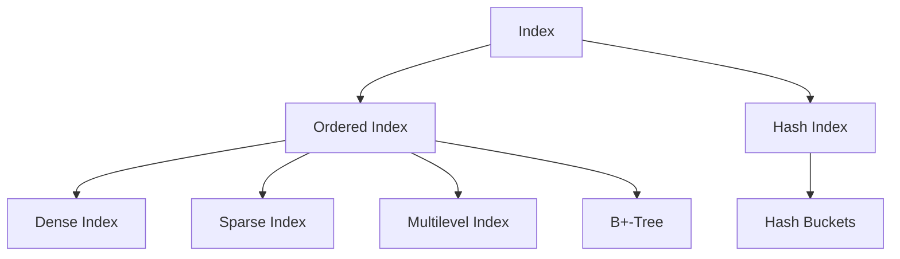
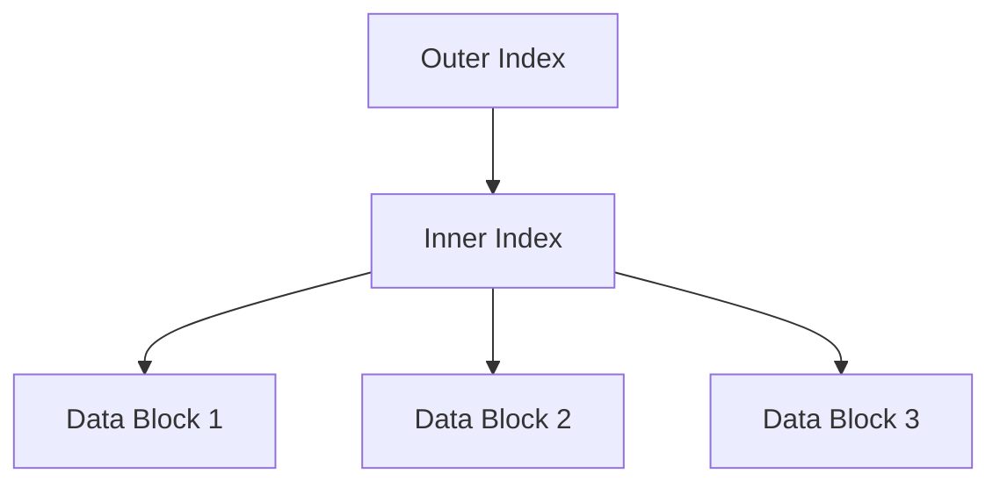
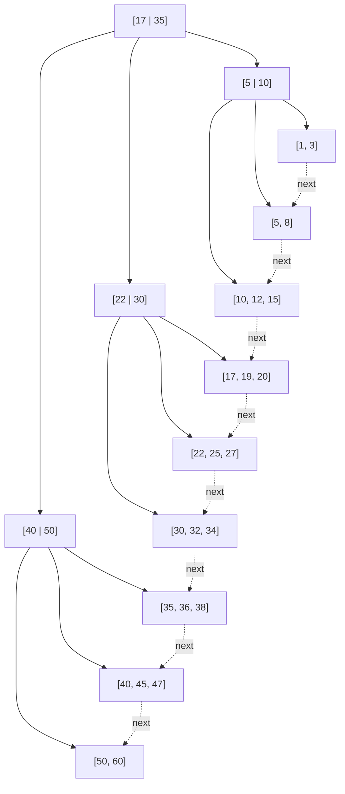
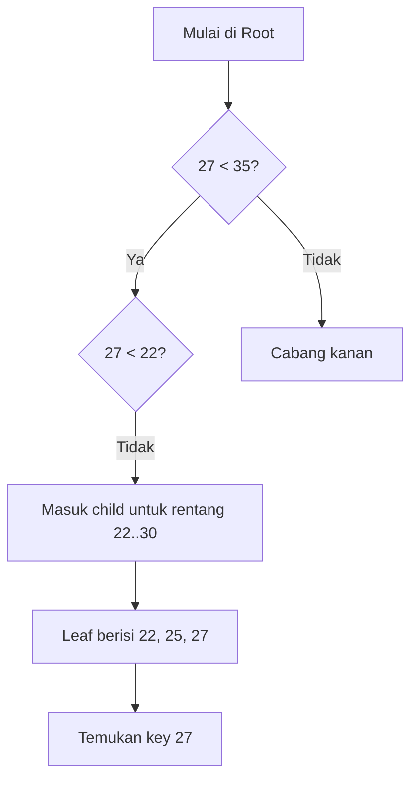
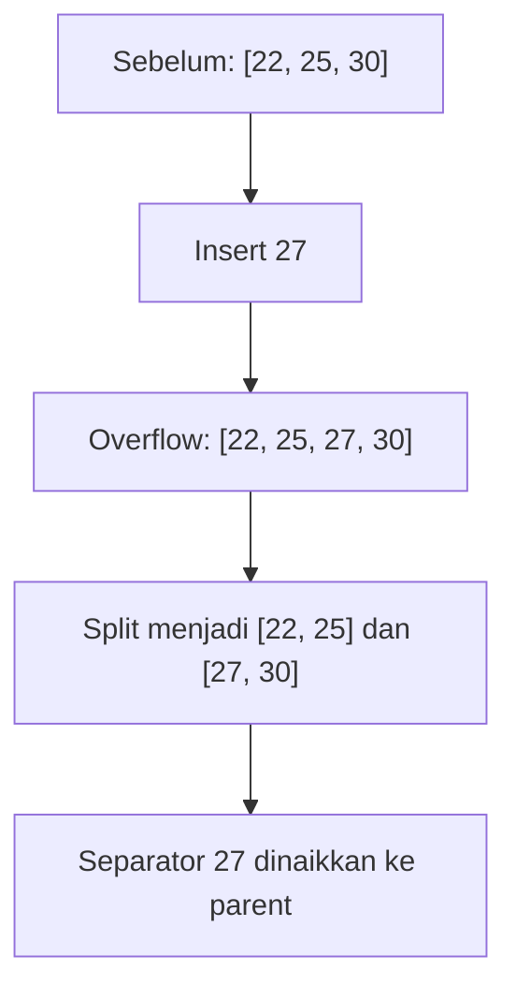
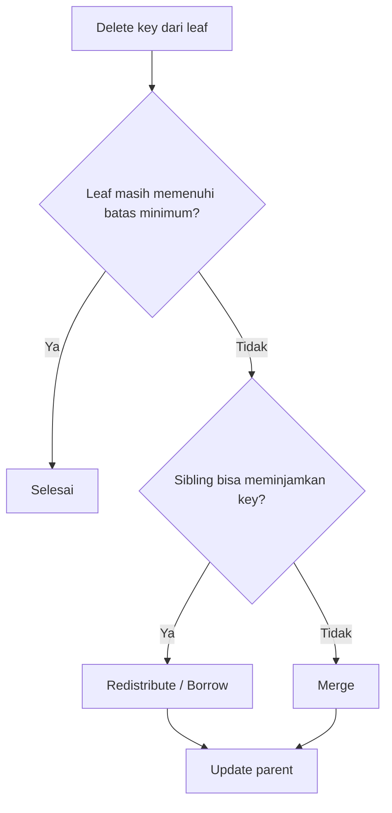
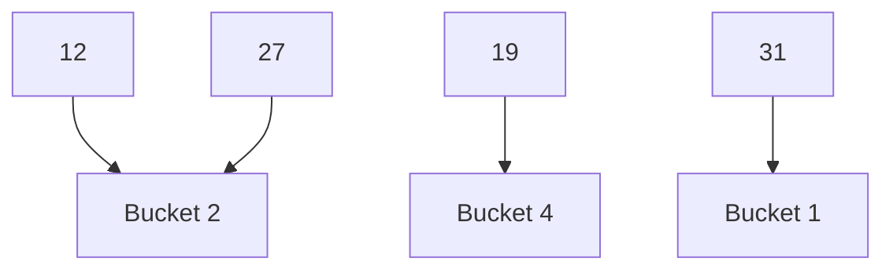
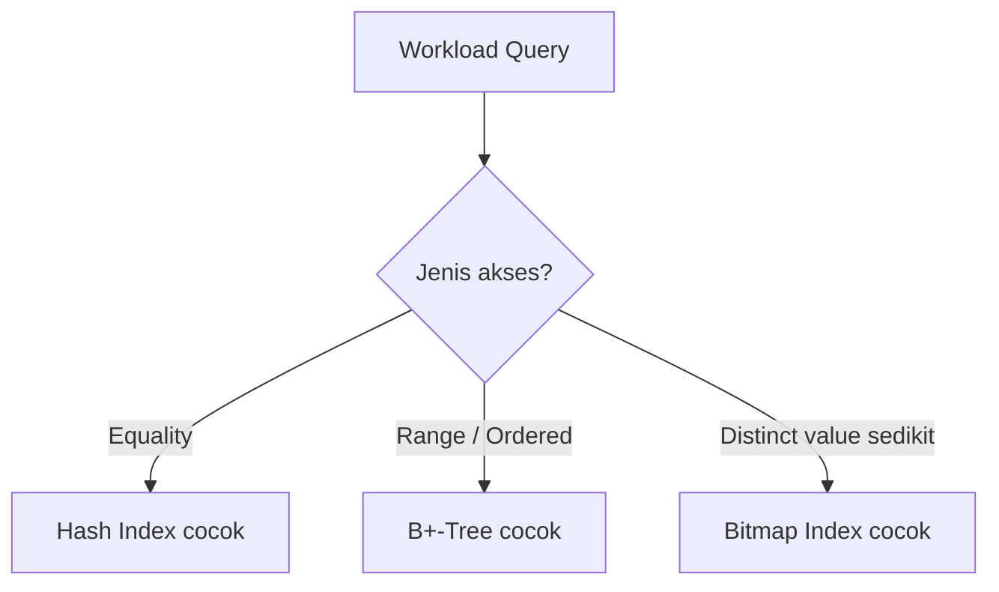

---
tags:
  - IF3140
  - Sistem-Basis-Data
  - Indexing
aliases:
  - Indexing
  - IF3140 Indexing
---

# Indexing

## 1. Gambaran Umum

**Index** adalah struktur data yang digunakan untuk mempercepat akses ke data yang diinginkan. Ide dasarnya mirip seperti **daftar isi** atau **katalog perpustakaan**: kita tidak perlu membaca seluruh isi tabel dari awal sampai akhir untuk menemukan data tertentu.

Tanpa index:

```text
Cari data
   ↓
Scan seluruh tabel
   ↓
Lambat jika tabel besar
```

Dengan index:

```text
Cari key
   ↓
Temukan entry index
   ↓
Lompat ke record yang sesuai
```

Index sangat membantu operasi seperti:

- pencarian data,
- pengurutan,
- join,
- dan range query tertentu.

> [!important]
> Index mempercepat pembacaan data, tetapi biasanya menambah **space overhead** dan **biaya insert/delete/update**, karena struktur index juga harus ikut dipelihara.

---

## 2. Search Key

**Search key** adalah attribute, atau gabungan beberapa attribute, yang digunakan untuk mencari record di file.

Secara umum, entry pada index berbentuk:

```text
search-key → pointer
```

- **search-key**: nilai yang dicari
- **pointer**: penunjuk ke record atau ke block data

Contoh sederhana:

```text
10101 → alamat record dosen A
12121 → alamat record dosen B
15151 → alamat record dosen C
```

---

## 3. Dua Keluarga Besar Index

Materi membagi index ke dua kelompok besar:

1. **Ordered Indices**
2. **Hash Indices**



### Ordered Index
Search key disimpan dalam **urutan terurut**.

### Hash Index
Search key dipetakan ke **bucket** menggunakan **hash function**.

---

## 4. Metrik Evaluasi Index

Sebuah metode indexing biasanya dibandingkan berdasarkan:

- **Access types supported efficiently**  
  Misalnya:
  - equality query (`id = 10`)
  - range query (`gaji >= 5 juta and gaji <= 8 juta`)

- **Access time**  
  Seberapa cepat data ditemukan.

- **Insertion time**  
  Seberapa mahal memasukkan data baru.

- **Deletion time**  
  Seberapa mahal menghapus data.

- **Space overhead**  
  Berapa tambahan ruang yang dibutuhkan oleh index.

> [!note]
> Tidak ada satu jenis index yang selalu terbaik. Pilihan index harus disesuaikan dengan workload.

---

# 5. Ordered Indices

Pada **ordered index**, seluruh index entries disimpan secara terurut berdasarkan search key.

Contoh sederhana:

```text
10101 → ptr
12121 → ptr
15151 → ptr
22222 → ptr
32343 → ptr
```

Karena terurut, ordered index mendukung:

- equality search,
- pencarian berdasarkan prefix tertentu,
- **range query** dengan baik.

---

## 5.1 Primary Index vs Secondary Index

### Primary Index / Clustering Index

Primary index adalah index yang search key-nya sesuai dengan **urutan fisik data di file**.

Artinya data records pada file juga tersusun mengikuti key tersebut.

```text
Primary index pada ID:

Index:         Data Records:
10101 ───────► [10101, ...]
12121 ───────► [12121, ...]
15151 ───────► [15151, ...]
22222 ───────► [22222, ...]
```

Karena urutan index dan urutan data sejalan, index ini disebut juga **clustering index**.

> Satu tabel hanya bisa punya **satu** clustered index, karena data fisik hanya bisa disusun dalam satu urutan utama.

---

### Secondary Index / Non-Clustering Index

Secondary index adalah index yang search key-nya **tidak mengikuti urutan fisik file**.

Contoh: file mungkin diurutkan berdasarkan `ID`, tetapi kita membuat index pada `dept_name`.

```text
Secondary index pada dept_name:

Comp. Sci. ──► bucket pointer ke semua record Comp. Sci.
Finance   ──► bucket pointer ke semua record Finance
History   ──► bucket pointer ke semua record History
```

Karena data aslinya tidak tersusun berdasarkan `dept_name`, index ini biasanya perlu menyimpan pointer ke record-record yang sesuai.

---

## 5.2 Dense Index

Pada **dense index**, **setiap search-key** yang muncul pada data juga muncul pada index.

```text
Data records:
10101
12121
15151
22222

Dense index:
10101 → ptr
12121 → ptr
15151 → ptr
22222 → ptr
```

### Kelebihan Dense Index
- pencarian sangat cepat,
- langsung bisa menuju record yang dicari.

### Kekurangan Dense Index
- membutuhkan ruang lebih besar,
- insert/delete/update lebih mahal karena lebih banyak entry yang harus dipelihara.

---

## 5.3 Sparse Index

Pada **sparse index**, hanya **sebagian** search-key yang disimpan di index.

Biasanya sparse index dipakai ketika file data **sudah terurut** berdasarkan search key.

```text
Data blocks:
Block 1: 10101, 12121
Block 2: 15151, 22222
Block 3: 32343, 33456

Sparse index:
10101 → Block 1
15151 → Block 2
32343 → Block 3
```

Cara mencarinya:
1. cari index entry terbesar yang nilainya `<= K`,
2. loncat ke block terkait,
3. lanjutkan pencarian secara sequential di block tersebut.

### Kelebihan Sparse Index
- lebih hemat ruang,
- maintenance lebih ringan.

### Kekurangan Sparse Index
- pencarian biasanya lebih lambat dibanding dense index.

> [!tip]
> Trade-off yang umum dipakai adalah satu sparse index entry untuk setiap block data.

---

## 5.4 Dense vs Sparse Index

| Aspek | Dense Index | Sparse Index |
|---|---|---|
| Entry index | Semua key muncul | Hanya sebagian key |
| Ruang | Lebih besar | Lebih kecil |
| Search | Lebih cepat | Sedikit lebih lambat |
| Update/Maintenance | Lebih mahal | Lebih ringan |
| Syarat file data terurut | Tidak seketat sparse | Sangat penting |

---

## 5.5 Secondary Index Harus Dense

Untuk secondary index, data fisik tidak terurut berdasarkan search key tersebut.

Karena itu:
- kita tidak bisa hanya menyimpan sebagian key lalu lanjut scan berurutan dengan mudah,
- maka secondary index **harus dense**.

Jika satu nilai search key muncul pada banyak record, index record biasanya menunjuk ke **bucket** atau daftar pointer.

```text
History → [ptr1, ptr2, ptr3]
Physics → [ptr4, ptr5]
```

---

## 5.6 Multilevel Index

Jika primary index sendiri terlalu besar untuk dimuat ke memory, maka pencariannya juga menjadi mahal.

Solusinya adalah membuat **index di atas index**.

```text
Outer Index (sparse)
      ↓
Inner Index (primary index)
      ↓
Data File
```

Diagram sederhana:



Intinya:
- index pertama mempercepat pencarian ke index kedua,
- index kedua mempercepat pencarian ke data.

Konsep ini menjadi dasar penting menuju **B+-Tree**.

---

## 5.7 Kekurangan Ordered Index Biasa

Pada index-sequential file, jika sering terjadi insert/delete/update:
- bisa muncul banyak **overflow block**,
- struktur menjadi kurang rapi,
- performa pencarian menurun,
- perlu **reorganization periodik**.

Inilah alasan mengapa **B+-Tree** menjadi solusi yang sangat populer.

---

# 6. B+-Tree Index

## 6.1 Ide Dasar

**B+-Tree** adalah pengembangan dari ordered index yang dapat:
- tetap terurut,
- mendukung insert/delete secara dinamis,
- menjaga performa tetap stabil tanpa reorganisasi total file.

B+-Tree sangat banyak digunakan di DBMS nyata.

### Keunggulan B+-Tree
- tetap seimbang,
- tinggi pohon kecil,
- pencarian cepat,
- range query efisien,
- insert/delete hanya memerlukan perubahan lokal.

### Kekurangan B+-Tree
- ada overhead ruang,
- insert/delete sedikit lebih kompleks.

---

## 6.2 Struktur Umum B+-Tree

Pada B+-Tree:
- **internal node** menyimpan key dan pointer ke child,
- **leaf node** menyimpan key dan pointer ke record,
- semua **leaf berada pada level yang sama**,
- leaf biasanya saling terhubung dengan pointer next-leaf.



> [!important]
> Leaf node saling terhubung inilah yang membuat **range query** pada B+-Tree sangat efisien.

---

## 6.3 Properti B+-Tree

Jika B+-Tree memiliki **maximum degree `n`**, maka:

1. semua jalur dari root ke leaf memiliki panjang yang sama,
2. setiap node internal (bukan root dan bukan leaf) punya jumlah child antara `ceil(n/2)` sampai `n`,
3. leaf node punya jumlah nilai antara `ceil((n-1)/2)` sampai `n-1`,
4. jika root bukan leaf, root minimal punya 2 child.

Implikasinya:
- pohon selalu **balanced**,
- tinggi pohon cenderung kecil,
- jumlah node yang harus diakses saat pencarian sedikit.

---

## 6.4 Mengapa B+-Tree Cepat?

Misal:
- satu node ukurannya kira-kira satu block disk,
- setiap node bisa memuat banyak key,
- maka faktor percabangannya tinggi.

Akibatnya tinggi pohon rendah.

Sebagai gambaran:
- jika `n` sekitar 100,
- dan ada 1 juta key,
- lookup bisa hanya perlu mengakses sekitar **4 node**.

```text
Root
 ↓
Internal
 ↓
Internal
 ↓
Leaf
```

Itulah sebabnya B+-Tree sangat efisien untuk penyimpanan disk.

---

## 6.5 Proses Pencarian di B+-Tree

Misal kita mencari key `27`.



Langkah umumnya:
1. mulai dari root,
2. bandingkan key yang dicari dengan separator key,
3. turun ke child yang sesuai,
4. ulangi sampai leaf,
5. cari key di leaf.

---

## 6.6 Range Query pada B+-Tree

Misal ingin mencari key dari `22` sampai `38`.

Langkahnya:
1. cari leaf pertama yang memuat `22`,
2. ambil semua nilai yang sesuai,
3. lanjut ke leaf berikutnya melalui **pointer next-leaf**,
4. berhenti saat nilai sudah melewati `38`.

```text
[22, 25, 27] -> [30, 32, 34] -> [35, 36, 38] -> stop
```

Inilah salah satu keunggulan utama B+-Tree dibanding hash index.

---

## 6.7 Insert pada B+-Tree

Ketika key baru dimasukkan:

### Kasus 1 — Leaf masih muat
Key cukup ditambahkan pada leaf dan tetap dijaga terurut.

### Kasus 2 — Leaf penuh
Leaf harus di-**split**.

Contoh sederhana:

Sebelum insert `27`:

```text
Leaf: [22, 25, 30]
```

Setelah insert, leaf overflow:

```text
[22, 25, 27, 30]
```

Karena penuh, lakukan split:

```text
[22, 25]   [27, 30]
      \     /
       key separator naik ke parent
```

Diagram:



Jika parent juga overflow, split bisa merambat ke atas.

---

## 6.8 Delete pada B+-Tree

Saat key dihapus:

### Kasus 1 — Leaf masih cukup penuh
Hapus biasa.

### Kasus 2 — Leaf menjadi underfull
Ada dua kemungkinan:
1. **borrow/redistribute** dari sibling,
2. **merge** dengan sibling.

### Borrow

```text
Sebelum:
Left  = [17, 19, 20]
Right = [22]

Borrow satu nilai dari left
↓
Left  = [17, 19]
Right = [20, 22]
```

### Merge

```text
Sebelum:
Left  = [17]
Right = [20]

Merge
↓
[17, 20]
```

Diagram ringkas:



---

## 6.9 B+-Tree File Organization

Pada **B+-Tree file organization**, leaf node menyimpan **record langsung**, bukan hanya pointer ke record.

```text
Internal node: key + child pointer
Leaf node    : key + record
```

Keuntungannya:
- data tetap ter-cluster,
- insert/delete/update masih bisa ditangani dengan prinsip B+-Tree.

Namun karena record lebih besar daripada pointer:
- leaf menampung record lebih sedikit,
- space utilization menjadi isu penting.

---

# 7. Hash Index

## 7.1 Ide Dasar

Berbeda dari ordered index, **hash index** tidak menjaga key dalam urutan terurut.

Hash index menggunakan:

```text
h(search-key) → bucket
```

di mana:
- `h` = hash function
- `bucket` = unit penyimpanan yang berisi satu atau lebih index entry

```mermaid
flowchart LR
    A[Search Key] --> B[Hash Function h(k)]
    B --> C[Bucket]
    C --> D[Search key + pointer]
```

---

## 7.2 Contoh Sederhana Hashing

Misalkan ada 5 bucket:
- Bucket 0
- Bucket 1
- Bucket 2
- Bucket 3
- Bucket 4

dan fungsi hash:

```text
h(k) = k mod 5
```

Maka:

```text
12 → h(12)=2 → Bucket 2
19 → h(19)=4 → Bucket 4
27 → h(27)=2 → Bucket 2
31 → h(31)=1 → Bucket 1
```

Diagram:



Perhatikan bahwa 12 dan 27 sama-sama masuk ke Bucket 2. Ini disebut **collision**.

---

## 7.3 Bucket

Bucket biasanya adalah satu unit storage, sering kali satu block disk.

Bucket berisi:
- search key,
- pointer ke record,
- atau pada hash file organization bisa langsung berisi record.

Contoh isi bucket:

```text
Bucket 2:
12 → ptrA
27 → ptrB
42 → ptrC
```

---

## 7.4 Collision dan Overflow Bucket

Dua key yang berbeda bisa dipetakan ke bucket yang sama. Ini adalah **collision**.

Jika bucket utama sudah penuh, digunakan **overflow bucket**.

```text
Bucket 5:
[15, 25, 35] -> Overflow Bucket -> [45, 55]
```

Diagram:


Konsep ini disebut **overflow chaining**.

### Dampaknya
- equality lookup tetap bisa cepat,
- tetapi jika banyak collision, pencarian di bucket menjadi lebih lambat karena perlu scan dalam bucket dan overflow chain.

---

## 7.5 Equality Query vs Range Query

### Hash Index sangat baik untuk:
- `id = 10101`
- `dept_name = 'Physics'`

### Hash Index buruk untuk:
- `id BETWEEN 10000 AND 20000`
- `salary > 7000`

Alasannya karena hasil hash **tidak mempertahankan urutan**.

```text
Key terurut? Tidak
Range query mudah? Tidak
Equality query cepat? Ya
```

> [!important]
> **Hash index unggul untuk equality query, tetapi tidak cocok untuk range query.**

---

## 7.6 Sifat Hash Function yang Baik

Hash function ideal sebaiknya:

### 1. Uniform
Setiap bucket mendapat jumlah record yang kurang lebih seimbang.

### 2. Random
Distribusi ke bucket tetap seimbang walaupun distribusi nilai key tidak seragam.

Jika fungsi hash buruk:
- beberapa bucket terlalu penuh,
- beberapa bucket hampir kosong,
- collision meningkat,
- performa turun.

---

## 7.7 Static Hashing vs Dynamic Hashing

### Static Hashing
Jumlah bucket ditetapkan sejak awal dan **tetap**.

Kelebihan:
- sederhana.

Kekurangan:
- jika data bertambah banyak, collision dan overflow bisa meningkat.

### Dynamic Hashing
Jumlah bucket bisa bertambah atau index dibangun ulang agar menampung data yang semakin besar.

Kelebihan:
- lebih fleksibel terhadap pertumbuhan data.

Kekurangan:
- implementasi lebih kompleks.

---

# 8. Hash File Organization

Pada **hash file organization**, fungsi hash tidak hanya dipakai untuk index, tetapi langsung menentukan bucket tempat record disimpan.

```text
record
  ↓
ambil search key
  ↓
hash function
  ↓
bucket tujuan
  ↓
simpan record
```

Diagram:

```mermaid
flowchart TD
    A[Record baru] --> B[Ambil search-key]
    B --> C[Hitung h(key)]
    C --> D[Temukan bucket]
    D --> E[Simpan record pada bucket]
```

Kelebihan:
- equality access sangat cepat.

Kekurangan:
- bucket bisa overflow,
- range query tidak efisien.

---

# 9. B+-Tree vs Hash Index

| Aspek | B+-Tree | Hash Index |
|---|---|---|
| Struktur data | Tree terurut | Bucket berdasarkan hash |
| Equality query | Cepat | Sangat cepat |
| Range query | Sangat baik | Buruk |
| Urutan data | Terjaga | Tidak terjaga |
| Insert/Delete | Perlu split/merge/redistribute | Perlu penanganan collision/overflow |
| Cocok untuk | Query campuran, termasuk range | Equality lookup |

---

## 9.1 Kapan Memilih B+-Tree?

Gunakan **B+-Tree** jika:
- banyak query range,
- data sering perlu diurutkan,
- ingin performa stabil untuk banyak jenis query,
- perlu traversal berurutan.

Contoh:
- mencari mahasiswa dengan NIM antara A dan B,
- mencari transaksi per tanggal dalam suatu rentang,
- menampilkan daftar data terurut.

---

## 9.2 Kapan Memilih Hash Index?

Gunakan **Hash Index** jika:
- query didominasi oleh equality search,
- range query jarang/tidak penting,
- ingin akses sangat cepat ke key tertentu.

Contoh:
- mencari user berdasarkan username persis,
- mencari record berdasarkan ID persis,
- lookup kode barang tertentu.

---

# 10. Bitmap Index

**Bitmap index** adalah index khusus untuk attribute yang memiliki jumlah distinct value relatif sedikit.

Contoh:
- gender,
- state,
- country,
- kategori level pendapatan.

Misal attribute `gender`:
- Male
- Female

Kita bisa simpan bitmap seperti:

```text
Male   : 1 0 1 1 0
Female : 0 1 0 0 1
```

Kemudian query kombinasi attribute bisa dijawab dengan operasi bit:

- AND
- OR
- NOT

Contoh:

```text
Male AND Income_L1
10110
AND
10010
=
10010
```

Bitmap index sangat berguna untuk query analitik multi-atribut, tetapi tidak terlalu istimewa untuk single-attribute lookup biasa.

---

# 11. Perintah SQL untuk Index

Secara umum, SQL menyediakan perintah membuat index:

```sql
create index <index-name> on <relation-name>(<attribute-list>);
```

Contoh:

```sql
create index b_index on branch(branch_name);
```

Untuk index unik:

```sql
create unique index idx_nim on mahasiswa(nim);
```

Menghapus index:

```sql
drop index <index-name>;
```

Contoh:

```sql
drop index b_index;
```

---

# 12. Hubungan Antar Konsep



Inti pemilihannya:
- **Equality** → cenderung cocok dengan **hash**
- **Range / urutan / traversal** → cenderung cocok dengan **B+-Tree**
- **Atribut cardinality kecil** → pertimbangkan **bitmap**

---

# 13. Ringkasan Inti Materi

> [!important] Inti Materi
> Index adalah struktur tambahan untuk mempercepat akses data. Namun pemakaiannya selalu membawa trade-off antara kecepatan baca, biaya maintenance, dan tambahan ruang.

Poin penting yang perlu diingat:

1. **Ordered index** menyimpan key dalam urutan terurut.
2. **Dense index** menyimpan semua key, sedangkan **sparse index** hanya sebagian key.
3. **Primary index** mengikuti urutan fisik data, sedangkan **secondary index** tidak.
4. **Secondary index harus dense**.
5. **Multilevel index** membuat index di atas index agar pencarian lebih efisien.
6. **B+-Tree** adalah ordered index yang sangat populer karena balanced, dinamis, dan efisien untuk range query.
7. Leaf B+-Tree saling terhubung sehingga traversal berurutan menjadi cepat.
8. Insert/delete pada B+-Tree ditangani dengan **split, borrow/redistribute, dan merge**.
9. **Hash index** memetakan key ke bucket menggunakan hash function.
10. Hash index sangat baik untuk **equality query**, tetapi buruk untuk **range query**.
11. Collision pada hash menyebabkan **overflow bucket**.
12. **Bitmap index** cocok untuk atribut dengan sedikit distinct value.

---

# 14. Ringkasan Cepat Per Jenis Index

| Jenis | Kelebihan utama | Kekurangan utama |
|---|---|---|
| Ordered Index | Mendukung urutan dan range query | Bisa butuh reorganisasi |
| Dense Index | Lookup cepat | Butuh ruang lebih |
| Sparse Index | Hemat ruang | Search lebih lambat |
| B+-Tree | Balanced, dinamis, range query kuat | Implementasi lebih kompleks |
| Hash Index | Equality query sangat cepat | Tidak cocok range query |
| Bitmap Index | Efisien untuk kombinasi atribut dengan cardinality kecil | Tidak ideal untuk semua jenis query |

---

# 15. Cara Mengingat Cepat

```text
Kalau query = persis sama
→ pikirkan HASH

Kalau query = rentang / urut / traversal
→ pikirkan B+-TREE

Kalau value kategori sedikit
→ pikirkan BITMAP
```
